<center>


**UNIVERSIDAD PRIVADA DE TACNA**

**FACULTAD DE INGENIERIA**

**Escuela Profesional de Ingeniería de Sistemas**

**Proyecto *EPIS Analytics***

Curso: *Inteligencia de negocios*

Docente: *Mag. Patrick Cuadros Quiroga*

Integrantes:

***Enzo Leonel Laqui Luyo (2022073907)***

***Steven Christopher Yizuka Baldeón (2002023628)***

**Tacna - Perú**

***2026***

</center>

<div style="page-break-after: always; visibility: hidden">\pagebreak</div>

| CONTROL DE VERSIONES ||||||
| :-: | :- | :- | :- | :- | :- |
| Versión | Hecha por | Revisada por | Aprobada por | Fecha | Motivo |
| 1.0 | Equipo del proyecto | Equipo del proyecto | Docente del curso | 25/04/2026 | Versión inicial del informe |

<div style="page-break-after: always; visibility: hidden">\pagebreak</div>

# Sistema *EPIS Analytics*

## Documento de Especificación de Requerimientos de Software

Versión *{1.0}*

| CONTROL DE VERSIONES ||||||
| :-: | :- | :- | :- | :- | :- |
| Versión | Hecha por | Revisada por | Aprobada por | Fecha | Motivo |
| 1.0 | Equipo del proyecto | Equipo del proyecto | Docente del curso | 25/04/2026 | Versión inicial del documento de requerimientos |

<div style="page-break-after: always; visibility: hidden">\pagebreak</div>

# Índice General

- [Introducción](#introducción)
- [I. Generalidades de la Empresa](#i-generalidades-de-la-empresa)
  - [1. Nombre de la Empresa](#1-nombre-de-la-empresa)
  - [2. Visión](#2-visión)
  - [3. Misión](#3-misión)
  - [4. Organigrama](#4-organigrama)
- [II. Visionamiento de la Empresa](#ii-visionamiento-de-la-empresa)
  - [1. Descripción del Problema](#1-descripción-del-problema)
  - [2. Objetivos de Negocios](#2-objetivos-de-negocios)
  - [3. Objetivos de Diseño](#3-objetivos-de-diseño)
  - [4. Alcance del proyecto](#4-alcance-del-proyecto)
  - [5. Viabilidad del Sistema](#5-viabilidad-del-sistema)
  - [6. Información obtenida del Levantamiento de Información](#6-información-obtenida-del-levantamiento-de-información)
- [III. Análisis de Procesos](#iii-análisis-de-procesos)
  - [a. Diagrama del Proceso Actual - Diagrama de actividades](#a-diagrama-del-proceso-actual---diagrama-de-actividades)
  - [b. Diagrama del Proceso Propuesto - Diagrama de actividades Inicial](#b-diagrama-del-proceso-propuesto---diagrama-de-actividades-inicial)
- [IV. Especificación de Requerimientos de Software](#iv-especificación-de-requerimientos-de-software)
  - [a. Cuadro de Requerimientos funcionales Inicial](#a-cuadro-de-requerimientos-funcionales-inicial)
  - [b. Cuadro de Requerimientos No funcionales](#b-cuadro-de-requerimientos-no-funcionales)
  - [c. Cuadro de Requerimientos funcionales Final](#c-cuadro-de-requerimientos-funcionales-final)
  - [d. Reglas de Negocio](#d-reglas-de-negocio)
- [V. Fase de Desarrollo](#v-fase-de-desarrollo)
  - [1. Perfiles de Usuario](#1-perfiles-de-usuario)
  - [2. Modelo Conceptual](#2-modelo-conceptual)
  - [a. Diagrama de Paquetes](#a-diagrama-de-paquetes)
  - [b. Diagrama de Casos de Uso](#b-diagrama-de-casos-de-uso)
  - [c. Escenarios de Caso de Uso](#c-escenarios-de-caso-de-uso)
  - [3. Modelo Lógico](#3-modelo-lógico)
  - [a. Análisis de Objetos](#a-análisis-de-objetos)
  - [b. Diagrama de Actividades con objetos](#b-diagrama-de-actividades-con-objetos)
  - [c. Diagrama de Secuencia](#c-diagrama-de-secuencia)
  - [d. Diagrama de Clases](#d-diagrama-de-clases)
- [Conclusiones](#conclusiones)
- [Recomendaciones](#recomendaciones)
- [Bibliografía](#bibliografía)
- [Webgrafía](#webgrafía)

<div style="page-break-after: always; visibility: hidden">\pagebreak</div>

# Introducción

El presente documento contiene la **Especificación de Requerimientos de Software** del sistema **EPIS Analytics**, una solución web orientada al análisis de indicadores de actividad social de estudiantes de la Escuela Profesional de Ingeniería de Sistemas de la Universidad Privada de Tacna.

El sistema surge como respuesta a la necesidad de centralizar y visualizar información relacionada con publicaciones, alcance e interacciones en redes sociales relevantes para el entorno académico y profesional, considerando inicialmente LinkedIn, Instagram y YouTube. Para el prototipo se trabaja con datos simulados, organizados por estudiante, ciclo académico y red social.

El documento describe el contexto institucional, la problemática identificada, los objetivos de negocio y diseño, el alcance del proyecto, la viabilidad del sistema, el levantamiento de información, los procesos actuales y propuestos, así como las historias de usuario registradas en GitHub Issues. Estas historias se expresan en formato **Como... quiero... para...**, incluyen criterios de aceptación, escenarios de prueba en formato **Dado... Cuando... Entonces...** y diagramas de secuencia relacionados.

EPIS Analytics se implementa bajo una arquitectura cliente-servidor, con frontend Angular, backend FastAPI, persistencia local SQLite, autenticación mediante token, visualización con ECharts y una propuesta de infraestructura validada mediante Terraform e Infracost.

# I. Generalidades de la Empresa

## 1. Nombre de la Empresa

**Universidad Privada de Tacna (UPT)**

Para el presente proyecto, la organización beneficiaria es la **Universidad Privada de Tacna**, institución de educación superior universitaria ubicada en la ciudad de Tacna, Perú. El sistema propuesto, **EPIS Analytics**, está dirigido específicamente al contexto académico de la **Escuela Profesional de Ingeniería de Sistemas (EPIS)**, perteneciente a la Facultad de Ingeniería.

Aunque el formato del documento utiliza el término "empresa", en este caso se interpreta como la institución u organización para la cual se plantea la solución. Por ello, la entidad de referencia no es una empresa comercial, sino una universidad privada orientada a la formación profesional, investigación, proyección social y mejora continua de sus servicios académicos.

Según la información institucional publicada en el portal oficial de la UPT, la universidad es una institución de derecho privado, sin fines de lucro, con autonomía académica, económica, normativa, administrativa y de gobierno. Además, se indica que se rige por la Constitución Política del Perú, la Ley Universitaria, su ley de creación, estatuto y reglamentos institucionales.

En relación con el sistema EPIS Analytics, la Universidad Privada de Tacna cumple el rol de organización objetivo, mientras que los usuarios principales son estudiantes, docentes y responsables académicos vinculados a EPIS.

| Campo | Descripción |
| :- | :- |
| Nombre de la organización | Universidad Privada de Tacna |
| Sigla | UPT |
| Tipo de organización | Institución privada de educación superior universitaria |
| Ubicación | Tacna, Perú |
| Área beneficiaria directa | Escuela Profesional de Ingeniería de Sistemas |
| Sistema propuesto | EPIS Analytics |
| Usuarios principales | Estudiantes EPIS, docentes y coordinación académica |
| Fuente institucional | Portal oficial de la Universidad Privada de Tacna |

## 2. Visión

La visión institucional de la Universidad Privada de Tacna se orienta a consolidarse como **"una de las mejores instituciones de educación superior en el país"**, fortaleciendo la excelencia académica y el liderazgo en la formación del potencial humano que contribuya al desarrollo regional y nacional.

Desde la perspectiva del sistema EPIS Analytics, esta visión se relaciona directamente con la necesidad de incorporar herramientas tecnológicas que apoyen la gestión académica, el análisis de información y la toma de decisiones. El dashboard propuesto permite que la Escuela Profesional de Ingeniería de Sistemas cuente con una solución orientada a visualizar indicadores de participación digital de sus estudiantes, alineándose con una cultura institucional de mejora, calidad y uso estratégico de la información.

EPIS Analytics aporta a la visión institucional porque:

| Aporte del sistema | Relación con la visión institucional |
| :- | :- |
| Centraliza información académica simulada de presencia digital | Favorece una gestión más ordenada y basada en datos |
| Presenta dashboards personales y globales | Apoya el seguimiento y análisis de estudiantes |
| Usa tecnologías actuales como Angular, FastAPI y Terraform | Refuerza la modernización tecnológica dentro del entorno académico |
| Permite filtros por redes sociales relevantes | Facilita la interpretación de información vinculada al perfil profesional del estudiante |
| Incorpora login y rutas protegidas | Promueve un tratamiento más responsable de la información |

Por tanto, la visión aplicada al proyecto puede plantearse de la siguiente manera:

> EPIS Analytics busca contribuir a la mejora académica y tecnológica de la Escuela Profesional de Ingeniería de Sistemas mediante una plataforma web que permita analizar, visualizar y comprender indicadores de actividad social estudiantil, apoyando la toma de decisiones y la formación de profesionales con mayor presencia digital.

## 3. Misión

La misión institucional de la Universidad Privada de Tacna se centra en la formación de profesionales con una preparación integral, humanística, científica y técnica, orientada al liderazgo, la cultura de calidad, el respeto a la dignidad humana, la protección del medio ambiente, la valoración cultural y la identificación institucional. Asimismo, promueve la investigación y la proyección social como medios para contribuir a la transformación de la sociedad.

Aplicada al proyecto **EPIS Analytics**, esta misión se relaciona con la necesidad de fortalecer el uso de herramientas tecnológicas que apoyen la formación profesional de los estudiantes de la Escuela Profesional de Ingeniería de Sistemas. El sistema contribuye al desarrollo de competencias vinculadas al análisis de datos, visualización de información, toma de decisiones y uso responsable de plataformas digitales.

Desde el enfoque del sistema propuesto, la misión puede plantearse de la siguiente manera:

> Contribuir a la formación integral y tecnológica de los estudiantes de la Escuela Profesional de Ingeniería de Sistemas mediante una plataforma web de analítica social que permita visualizar, analizar y comprender indicadores de actividad digital, promoviendo el uso responsable de la información, la mejora continua y la toma de decisiones basada en datos.

El sistema EPIS Analytics se alinea con la misión institucional en los siguientes aspectos:

| Elemento de la misión institucional | Relación con EPIS Analytics |
| :- | :- |
| Formación integral | Permite que los estudiantes interpreten indicadores vinculados a su presencia digital y perfil profesional |
| Formación científica y técnica | Aplica conceptos de desarrollo web, arquitectura cliente-servidor, API REST, analítica y visualización de datos |
| Liderazgo y cultura de calidad | Promueve el uso de información organizada para evaluar y mejorar la participación digital |
| Investigación y proyección social | Puede servir como base para estudios sobre comportamiento digital académico |
| Identificación institucional | Enfoca el análisis en estudiantes de EPIS dentro del contexto de la Universidad Privada de Tacna |

## 4. Organigrama

La Universidad Privada de Tacna cuenta con una estructura de organización y gobierno universitaria. Según la información institucional consultada, la **Asamblea Universitaria** es el máximo organismo normativo de la universidad, y el **Consejo Universitario** es el órgano superior de dirección, ejecución, evaluación y promoción.

Para el presente proyecto, se toma como referencia la estructura institucional general de la UPT y se contextualiza hacia la Facultad de Ingeniería y la Escuela Profesional de Ingeniería de Sistemas, por ser el ámbito directo donde se ubica el sistema EPIS Analytics.

### Organigrama institucional de referencia

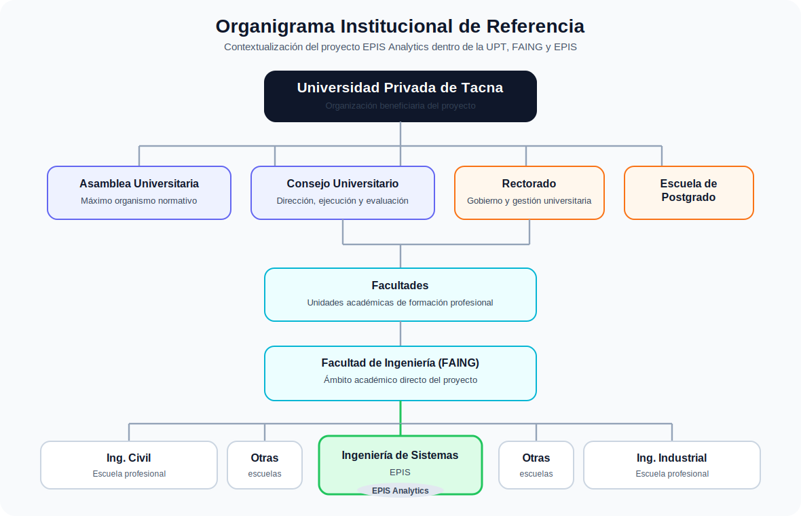

El gráfico anterior representa una vista de referencia para ubicar el proyecto dentro de la estructura institucional: Universidad Privada de Tacna, Facultad de Ingeniería y Escuela Profesional de Ingeniería de Sistemas. No reemplaza el organigrama oficial vigente; se usa como apoyo visual para contextualizar el alcance del sistema.

### Ubicación del sistema dentro del organigrama

El sistema **EPIS Analytics** se ubica funcionalmente dentro del entorno académico de la **Escuela Profesional de Ingeniería de Sistemas**, ya que está orientado al análisis de indicadores de estudiantes EPIS. Su uso puede involucrar a estudiantes, docentes, coordinación académica y responsables de seguimiento o mejora continua.

| Nivel organizacional | Relación con el sistema |
| :- | :- |
| Universidad Privada de Tacna | Organización beneficiaria del proyecto |
| Facultad de Ingeniería | Facultad a la que pertenece EPIS |
| Escuela Profesional de Ingeniería de Sistemas | Unidad académica directamente relacionada con el dashboard |
| Estudiantes EPIS | Usuarios principales del perfil personal |
| Docentes y coordinación académica | Usuarios de consulta y análisis global |
| Equipo técnico | Responsable de desarrollo, mantenimiento y documentación |

### Organigrama funcional para EPIS Analytics

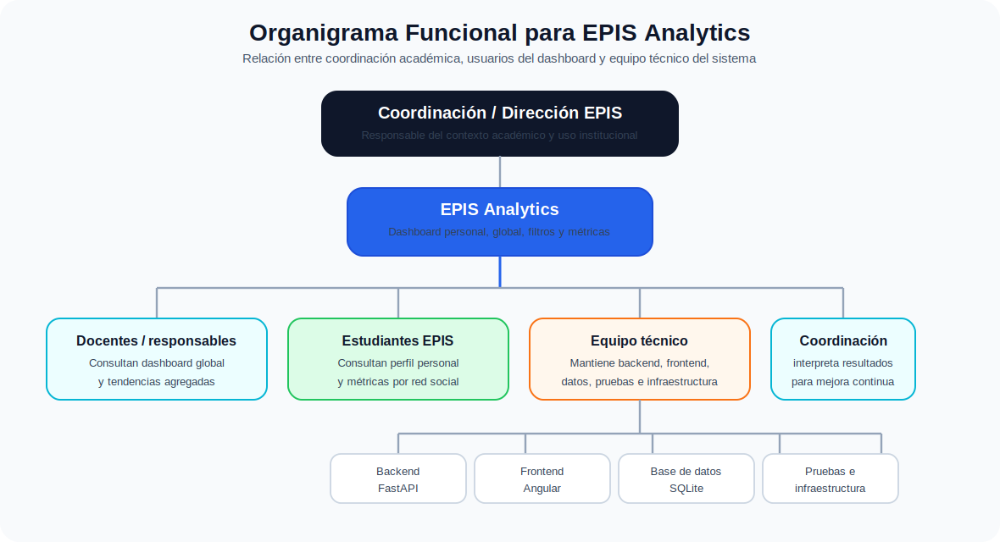

Este organigrama funcional no reemplaza el organigrama oficial de la universidad; se utiliza para representar cómo se relaciona el sistema propuesto con los usuarios y áreas involucradas en el proyecto.

# II. Visionamiento de la Empresa

## 1. Descripción del Problema

Actualmente, la información relacionada con la actividad digital de los estudiantes de la Escuela Profesional de Ingeniería de Sistemas se encuentra dispersa en distintas redes sociales. Plataformas como LinkedIn, Instagram y YouTube pueden reflejar distintos tipos de participación académica, profesional o comunicacional, pero no existe una herramienta centralizada que permita analizar estos datos de manera organizada.

Esta situación dificulta que los estudiantes, docentes o responsables académicos puedan observar indicadores de participación digital, comparar resultados por red social, identificar niveles de interacción o revisar tendencias generales por ciclo académico. La revisión manual de perfiles o publicaciones resulta poco eficiente, no permite obtener una visión global y limita la toma de decisiones basada en información.

Además, al no contar con dashboards o visualizaciones consolidadas, se pierde la oportunidad de interpretar el comportamiento digital estudiantil desde una perspectiva académica. Esto afecta la capacidad de identificar patrones, promover buenas prácticas de presencia profesional y fortalecer la visibilidad digital de los estudiantes EPIS.

Frente a esta problemática, se propone el desarrollo de **EPIS Analytics**, un sistema web que permite centralizar datos simulados de publicaciones, mostrar dashboards personales y globales, filtrar indicadores por red social y proteger el acceso mediante autenticación.

| Situación actual | Problema identificado | Impacto |
| :- | :- | :- |
| Datos dispersos en varias redes sociales | No existe una vista consolidada | Dificulta el análisis global |
| Consulta manual de información | Proceso lento y poco práctico | Consume tiempo y reduce precisión |
| Falta de indicadores visuales | No se identifican tendencias fácilmente | Limita la toma de decisiones |
| Ausencia de filtro por red social | No se puede comparar LinkedIn, Instagram y YouTube | Reduce el análisis específico |
| Sin control de acceso | Las vistas personales requieren protección | Riesgo en el manejo de información |

## 2. Objetivos de Negocios

Los objetivos de negocio representan los resultados que se esperan alcanzar con la implementación del sistema EPIS Analytics dentro del contexto académico de EPIS.

### Objetivo general de negocio

Implementar una herramienta web de analítica social que permita a la Escuela Profesional de Ingeniería de Sistemas visualizar indicadores de actividad digital estudiantil, facilitando el análisis, seguimiento y toma de decisiones sobre la presencia digital de los estudiantes.

### Objetivos específicos de negocio

| Código | Objetivo de negocio | Resultado esperado |
| :-: | :- | :- |
| ON-01 | Centralizar información de publicaciones simuladas de estudiantes EPIS | Contar con una base organizada por estudiante, ciclo, red social y fecha |
| ON-02 | Facilitar la consulta de indicadores personales | Permitir que cada estudiante visualice sus métricas principales |
| ON-03 | Facilitar el análisis global de la actividad digital | Permitir que docentes o responsables académicos revisen métricas agregadas |
| ON-04 | Comparar el rendimiento entre redes sociales | Analizar indicadores en vista general o filtrados por LinkedIn, Instagram y YouTube |
| ON-05 | Proteger el acceso a la información del dashboard | Incorporar login con usuario, contraseña y token |
| ON-06 | Apoyar la toma de decisiones académicas | Presentar datos mediante gráficos, rankings y métricas comprensibles |
| ON-07 | Disponer de una base tecnológica extensible | Permitir futuras mejoras como datos reales, búsqueda avanzada, roles y despliegue cloud |

## 3. Objetivos de Diseño

Los objetivos de diseño definen las características técnicas y funcionales que guían la construcción del sistema.

### Objetivo general de diseño

Diseñar un sistema web cliente-servidor, modular y mantenible, que separe la interfaz de usuario, la API, la lógica de negocio, el acceso a datos y la infraestructura propuesta.

### Objetivos específicos de diseño

| Código | Objetivo de diseño | Decisión aplicada |
| :-: | :- | :- |
| OD-01 | Separar frontend y backend | Angular para la interfaz y FastAPI para la API REST |
| OD-02 | Organizar el backend por capas | Modelos, repositorios, servicios y rutas/controladores |
| OD-03 | Permitir persistencia local para el prototipo | Uso de SQLite con repositorios |
| OD-04 | Facilitar visualización de datos | Uso de dashboards y gráficos con ECharts |
| OD-05 | Incorporar autenticación | Login con usuario, contraseña, hash y token firmado |
| OD-06 | Permitir filtros por red social | Vista general y filtros por LinkedIn, Instagram y YouTube |
| OD-07 | Considerar todos los ciclos EPIS | Datos estructurados para ciclos I al X |
| OD-08 | Validar funcionalidad mediante pruebas | Pruebas unitarias, pruebas de API y build frontend |
| OD-09 | Preparar análisis de infraestructura | Módulo Terraform validado e Infracost para costos |
| OD-10 | Mantener posibilidad de evolución | Arquitectura preparada para datos reales, roles y despliegue |

La arquitectura de diseño planteada es:

```text
Angular Frontend
  ├── Login
  ├── Dashboard personal
  ├── Dashboard global
  ├── Servicios HTTP
  └── AuthGuard / AuthInterceptor

FastAPI Backend
  ├── Routes / Controllers
  ├── Services
  ├── Repositories
  ├── Models
  └── SQLite
```

## 4. Alcance del proyecto

El alcance del proyecto comprende el desarrollo de un prototipo funcional del sistema **EPIS Analytics**, orientado al análisis de actividad social simulada de estudiantes EPIS.

### Alcance incluido

| Elemento | Descripción | Estado |
| :- | :- | :-: |
| Generación de datos simulados | Publicaciones asociadas a estudiantes, ciclos, formatos, fechas, alcance e interacciones | Implementado |
| Consideración de ciclos EPIS | Datos organizados para ciclos I al X | Implementado |
| Redes sociales consideradas | LinkedIn, Instagram y YouTube | Implementado |
| Backend FastAPI | API REST para autenticación, estudiantes y dashboards | Implementado |
| Frontend Angular | Interfaz web para login, dashboard personal y dashboard global | Implementado |
| Dashboard personal | Métricas e indicadores por estudiante | Implementado |
| Dashboard global | Indicadores agregados por ciclo, red social y ranking | Implementado |
| Filtro por red social | Vista general y filtrado por red específica | Implementado |
| Login real básico | Usuario, contraseña, hash, token y rutas protegidas | Implementado |
| Gráficos reales | Visualizaciones con ECharts | Implementado |
| Pruebas | Pruebas backend, API, frontend y build | Implementado |
| Documentación | FD01, FD02, Wiki, RoadMap y FD03 en proceso | En desarrollo |
| Terraform | Infraestructura propuesta y validada para análisis de costos | Implementado |
| Infracost | Estimación de costo base mensual | Implementado |

### Alcance no incluido en la versión actual

| Elemento no incluido | Motivo |
| :- | :- |
| Consumo real de APIs de LinkedIn, Instagram o YouTube | Requiere permisos, credenciales, políticas de uso y tratamiento de datos reales |
| Despliegue real en AWS | La infraestructura está validada, pero no se ejecutó `terraform apply` para evitar costos reales |
| Gestión avanzada de roles | El login actual cubre el prototipo; roles administrativos quedan para una fase futura |
| Cambio de contraseña desde la interfaz | Funcionalidad pendiente para una versión posterior |
| Exportación de reportes PDF/CSV | No es parte del alcance principal actual |
| Integración con Power BI real | Se evaluó como mejora futura, no como requisito base |

### Entregables del alcance actual

| Entregable | Descripción |
| :- | :- |
| Código backend | Modelos, repositorios, servicios, rutas y autenticación |
| Código frontend | Angular con vistas, filtros, gráficos y login |
| Base de datos local | SQLite con datos simulados |
| Pruebas automatizadas | Validación funcional del backend y frontend |
| Diagrama de arquitectura | Archivo PlantUML actualizado |
| Infraestructura Terraform | Módulo en `infra/terraform` |
| Documentación | Informes FD01, FD02, FD03 y Wiki del proyecto |

## 5. Viabilidad del Sistema

La viabilidad del sistema EPIS Analytics se evalúa desde los enfoques técnico, operativo, económico y legal. De acuerdo con el desarrollo realizado, el sistema es viable como prototipo académico, ya que utiliza tecnologías disponibles, datos simulados y una arquitectura modular que puede evolucionar hacia una versión productiva.

### Viabilidad técnica

El sistema es técnicamente viable porque se construye con herramientas modernas y accesibles:

| Componente | Tecnología | Evaluación |
| :- | :- | :- |
| Frontend | Angular | Permite construir una interfaz web modular, mantenible y responsive |
| Backend | FastAPI | Facilita la creación de una API REST clara y testeable |
| Persistencia | SQLite | Adecuada para prototipo local con datos simulados |
| Gráficos | ECharts | Permite visualizaciones dinámicas para métricas y rankings |
| Autenticación | Token firmado | Suficiente para proteger rutas privadas en el prototipo |
| Pruebas | Pytest y Angular Test Runner | Permiten validar funcionalidad backend y frontend |
| Infraestructura | Terraform | Permite declarar una propuesta de despliegue cloud |
| Costos | Infracost | Permite estimar costos antes de desplegar recursos reales |

### Viabilidad operativa

El sistema es operativo porque los usuarios pueden interactuar con un flujo simple:

1. Ingresar al login.
2. Seleccionar o ingresar un estudiante.
3. Autenticarse con contraseña.
4. Acceder al dashboard personal.
5. Cambiar a dashboard global.
6. Filtrar la información por red social.

Este flujo puede ser utilizado por estudiantes, docentes y responsables académicos sin requerir conocimientos técnicos avanzados.

### Viabilidad económica

El proyecto es económicamente viable para un entorno académico porque utiliza herramientas de desarrollo sin costo directo y una infraestructura cloud mínima estimada. El análisis con Infracost sobre el módulo Terraform arroja un costo base aproximado de **USD 9.19 mensuales**, compuesto principalmente por una instancia EC2 t3.micro y almacenamiento EBS gp3.

| Concepto | Resultado |
| :- | :- |
| Desarrollo local | Viable con herramientas gratuitas |
| Base de datos | SQLite sin costo |
| Frontend y backend | Angular y FastAPI sin costo de licencia |
| Infraestructura propuesta | AWS de bajo consumo |
| Costo base mensual estimado | USD 9.19 |

### Viabilidad legal

La versión actual es legalmente viable porque utiliza datos simulados y no consume APIs reales de redes sociales. Para una etapa futura con datos reales, será necesario cumplir términos de uso de LinkedIn, Instagram y YouTube, además de considerar consentimiento informado y normativa de protección de datos personales.

### Conclusión de viabilidad

El sistema EPIS Analytics es viable como prototipo funcional y académico. Cumple con los objetivos principales definidos para la versión actual y deja una base preparada para mejoras futuras como integración con datos reales, roles administrativos, PostgreSQL o despliegue cloud controlado.

## 6. Información obtenida del Levantamiento de Información

El levantamiento de información se realizó a partir del análisis del contexto académico de EPIS, la revisión de necesidades del sistema, la definición de dashboards esperados y la documentación generada durante el desarrollo del proyecto.

### Fuentes de información consideradas

| Fuente | Información obtenida |
| :- | :- |
| Portal institucional UPT | Nombre institucional, misión, visión y organización de gobierno |
| Facultad de Ingeniería UPT | Contexto académico de la facultad y escuelas profesionales |
| Proyecto desarrollado | Funcionalidades implementadas, arquitectura y pruebas |
| GitHub Issues | Historias de usuario, criterios de aceptación y escenarios de prueba |
| Wiki del proyecto | Documentación de arquitectura, instalación, API, pruebas, Terraform y RoadMap |
| FD01 | Factibilidad y análisis de costos con Terraform |
| FD02 | Visión del producto, usuarios, capacidades y RoadMap |

### Necesidades identificadas

| Necesidad | Descripción |
| :- | :- |
| Centralizar información | Reunir datos simulados de actividad social estudiantil en un solo sistema |
| Visualizar indicadores | Mostrar métricas comprensibles mediante dashboards y gráficos |
| Comparar redes sociales | Analizar resultados generales o filtrados por LinkedIn, Instagram y YouTube |
| Proteger vistas privadas | Restringir acceso a dashboards mediante login y token |
| Considerar ciclos académicos | Organizar indicadores de estudiantes de ciclos I al X |
| Documentar requerimientos | Registrar historias de usuario, criterios y escenarios de prueba |

### Requerimientos derivados del levantamiento

| Código | Requerimiento derivado |
| :-: | :- |
| RD-01 | El sistema debe permitir autenticación de estudiantes |
| RD-02 | El sistema debe mostrar un dashboard personal |
| RD-03 | El sistema debe mostrar un dashboard global |
| RD-04 | El sistema debe permitir filtros por red social |
| RD-05 | El sistema debe listar estudiantes disponibles |
| RD-06 | El sistema debe proteger endpoints privados con token |
| RD-07 | El sistema debe mostrar gráficos y métricas visuales |
| RD-08 | El sistema debe contar con documentación y pruebas |
| RD-09 | El sistema debe contar con análisis de infraestructura y costos |

# III. Análisis de Procesos

## a. Diagrama del Proceso Actual - Diagrama de actividades

El proceso actual representa la situación sin EPIS Analytics. En este escenario, la información se encuentra distribuida en diferentes redes sociales y la revisión debe realizarse manualmente, sin centralización ni indicadores automáticos.

### Descripción del proceso actual

| Paso | Actividad | Problema |
| :-: | :- | :- |
| 1 | Identificar estudiante o grupo de estudiantes | No existe una lista centralizada de consulta |
| 2 | Revisar manualmente redes sociales | La información está dispersa |
| 3 | Observar publicaciones e interacciones | No hay cálculo automático de métricas |
| 4 | Comparar redes o ciclos manualmente | Proceso lento y propenso a errores |
| 5 | Elaborar conclusiones | La decisión depende de observación manual |

### Diagrama de actividades del proceso actual

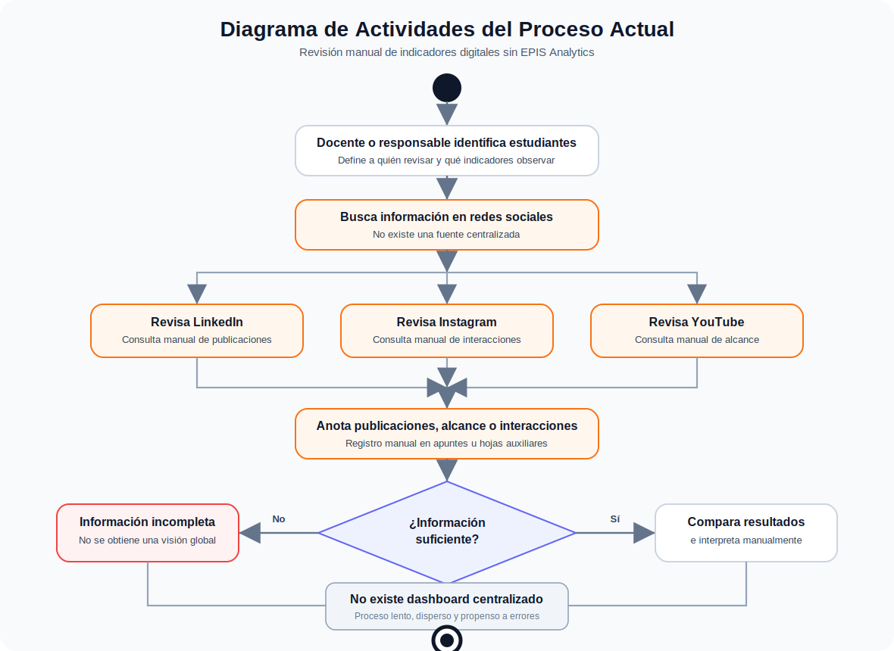

## b. Diagrama del Proceso Propuesto - Diagrama de actividades Inicial

El proceso propuesto incorpora EPIS Analytics como sistema centralizado para acceder a información simulada, autenticarse, visualizar dashboards y aplicar filtros por red social.

### Descripción del proceso propuesto

| Paso | Actividad | Resultado |
| :-: | :- | :- |
| 1 | Usuario accede al sistema | Se muestra pantalla de login |
| 2 | Usuario selecciona estudiante e ingresa contraseña | Se validan credenciales |
| 3 | Backend genera token si la autenticación es correcta | Se habilita acceso al dashboard |
| 4 | Usuario visualiza dashboard personal | Se muestran métricas individuales |
| 5 | Usuario accede al dashboard global | Se muestran indicadores agregados |
| 6 | Usuario filtra por red social | Los gráficos y métricas se actualizan |
| 7 | Usuario interpreta resultados | Se facilita la toma de decisiones |

### Diagrama de actividades del proceso propuesto

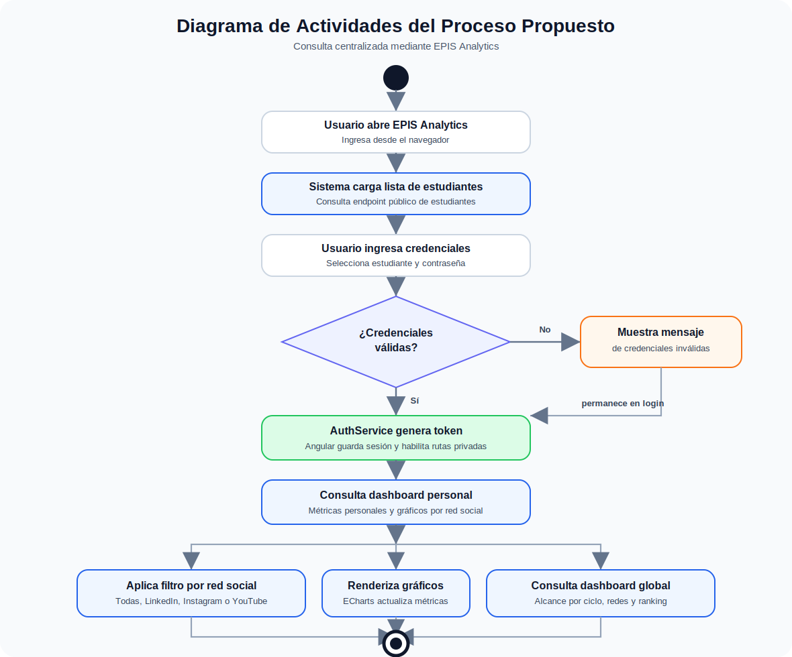

# IV. Especificación de Requerimientos de Software

## a. Cuadro de Requerimientos funcionales Inicial

Los requerimientos funcionales iniciales se obtienen a partir de las historias de usuario registradas como Issues en GitHub para ser gestionadas dentro del GitHub Project del proyecto.

| ID | Historia de usuario | GitHub Issue | Prioridad | Estado |
| :-: | :- | :-: | :-: | :-: |
| HU-01 | Autenticación de estudiante | [#1](https://github.com/UPT-FAING-EPIS/proyecto-si885-2026-i-inteligencia/issues/1) | Alta | Registrada |
| HU-02 | Consulta de dashboard personal | [#2](https://github.com/UPT-FAING-EPIS/proyecto-si885-2026-i-inteligencia/issues/2) | Alta | Registrada |
| HU-03 | Filtro por red social en dashboard personal | [#3](https://github.com/UPT-FAING-EPIS/proyecto-si885-2026-i-inteligencia/issues/3) | Alta | Registrada |
| HU-04 | Consulta de dashboard global | [#4](https://github.com/UPT-FAING-EPIS/proyecto-si885-2026-i-inteligencia/issues/4) | Alta | Registrada |
| HU-05 | Filtro por red social en dashboard global | [#5](https://github.com/UPT-FAING-EPIS/proyecto-si885-2026-i-inteligencia/issues/5) | Alta | Registrada |
| HU-06 | Consulta de lista de estudiantes | [#6](https://github.com/UPT-FAING-EPIS/proyecto-si885-2026-i-inteligencia/issues/6) | Media | Registrada |
| HU-07 | Protección de rutas privadas con token | [#7](https://github.com/UPT-FAING-EPIS/proyecto-si885-2026-i-inteligencia/issues/7) | Alta | Registrada |
| HU-08 | Visualización de métricas con gráficos | [#8](https://github.com/UPT-FAING-EPIS/proyecto-si885-2026-i-inteligencia/issues/8) | Alta | Registrada |
| HU-09 | Validación de infraestructura y costos | [#9](https://github.com/UPT-FAING-EPIS/proyecto-si885-2026-i-inteligencia/issues/9) | Media | Registrada |

## b. Cuadro de Requerimientos No funcionales

| ID | Requerimiento no funcional | Descripción | Criterio de cumplimiento |
| :-: | :- | :- | :- |
| RNF-01 | Seguridad | Las rutas privadas deben requerir token de autenticación | Las rutas `/api/dashboard/perfil` y `/api/dashboard/global` responden 401 sin token |
| RNF-02 | Usabilidad | La interfaz debe permitir acceso claro a login, dashboard personal y global | El usuario puede navegar sin instrucciones externas |
| RNF-03 | Rendimiento | Las consultas del prototipo deben responder en tiempos aceptables | Las métricas cargan sin bloqueo perceptible en ambiente local |
| RNF-04 | Mantenibilidad | El backend debe estar organizado por capas | Existen modelos, repositorios, servicios y rutas |
| RNF-05 | Portabilidad | El sistema debe poder ejecutarse localmente y proyectarse a cloud | Backend y frontend se ejecutan separados; existe módulo Terraform |
| RNF-06 | Testeabilidad | El sistema debe contar con pruebas automatizadas | Pytest, pruebas frontend y validación Terraform ejecutadas |
| RNF-07 | Escalabilidad funcional | La arquitectura debe permitir nuevas redes sociales o datos reales | Filtros y repositorios se encuentran desacoplados |
| RNF-08 | Control de costos | La infraestructura propuesta debe ser estimable antes del despliegue | Infracost estima costo base mensual de USD 9.19 |

## c. Cuadro de Requerimientos funcionales Final

| ID | Requerimiento funcional final | Historia relacionada | Descripción |
| :-: | :- | :-: | :- |
| RF-01 | Iniciar sesión | HU-01 | El sistema permite autenticar estudiantes mediante usuario, contraseña y token |
| RF-02 | Consultar dashboard personal | HU-02 | El sistema muestra métricas personales del estudiante autenticado |
| RF-03 | Filtrar dashboard personal por red social | HU-03 | El sistema permite consultar métricas personales por todas las redes o una red específica |
| RF-04 | Consultar dashboard global | HU-04 | El sistema muestra indicadores agregados de estudiantes EPIS |
| RF-05 | Filtrar dashboard global por red social | HU-05 | El sistema permite analizar indicadores globales por LinkedIn, Instagram o YouTube |
| RF-06 | Listar estudiantes | HU-06 | El sistema expone una lista de estudiantes disponibles para login y consulta |
| RF-07 | Proteger rutas privadas | HU-07 | El sistema bloquea solicitudes sin token válido en endpoints privados |
| RF-08 | Visualizar gráficos | HU-08 | El sistema renderiza gráficos para facilitar la interpretación de métricas |
| RF-09 | Validar infraestructura y costos | HU-09 | El sistema incluye Terraform e Infracost para sustentar factibilidad técnica y económica |

### Historias de usuario, criterios de aceptación y escenarios de prueba

#### HU-01 Autenticación de estudiante

**Como** estudiante EPIS,  
**quiero** iniciar sesión con mi usuario y contraseña,  
**para** acceder de forma segura a mi dashboard personal.

**Criterios de aceptación**

- El sistema debe permitir seleccionar o ingresar un usuario registrado.
- El sistema debe solicitar una contraseña.
- El sistema debe validar las credenciales contra el repositorio de usuarios.
- Si las credenciales son correctas, el sistema debe generar un token de acceso.
- Si las credenciales son incorrectas, el sistema debe mostrar un mensaje de error.
- El sistema no debe permitir acceder al dashboard personal sin una sesión válida.

**Escenarios de prueba**

Escenario: Inicio de sesión exitoso.

```gherkin
Dado que existe un estudiante registrado en el sistema
Y el estudiante se encuentra en la pantalla de login
Y el estudiante ingresa credenciales válidas
Cuando presiona el botón de ingresar
Entonces el sistema debe autenticar al estudiante
Y debe redirigirlo al dashboard personal
```

Escenario: Inicio de sesión fallido.

```gherkin
Dado que el estudiante se encuentra en la pantalla de login
Y el estudiante ingresa una contraseña incorrecta
Cuando presiona el botón de ingresar
Entonces el sistema debe mostrar un mensaje de credenciales inválidas
Y no debe permitir el acceso al dashboard
```

**Diagrama de secuencia**

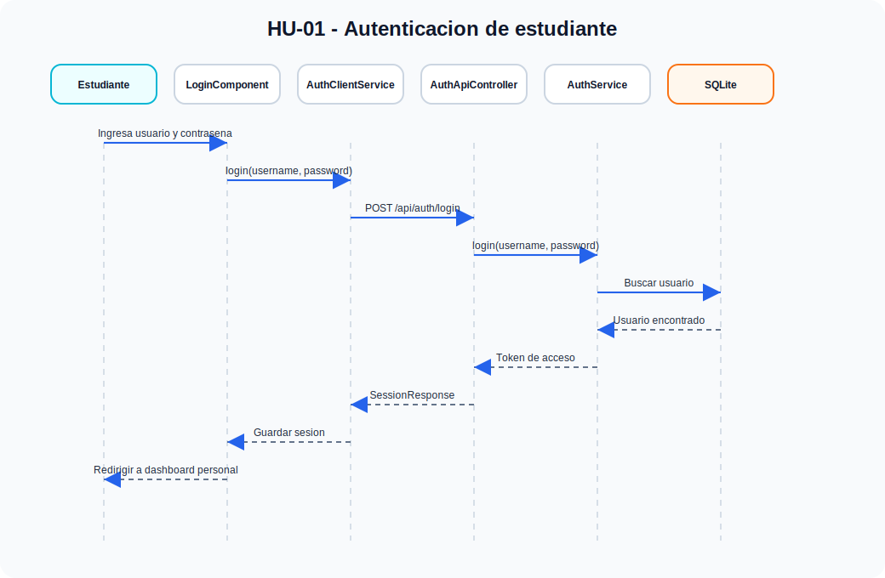

#### HU-02 Consulta de dashboard personal

**Como** estudiante EPIS,  
**quiero** visualizar mi dashboard personal,  
**para** conocer mis métricas de publicaciones, alcance e interacciones.

**Criterios de aceptación**

- El sistema debe permitir acceder al dashboard personal solo si existe una sesión válida.
- El sistema debe consultar las métricas del estudiante autenticado.
- El sistema debe mostrar total de publicaciones, interacciones y red social destacada.
- El sistema debe mostrar gráficos de interacciones en el tiempo e interacciones por red.
- Si no existen datos del estudiante, el sistema debe mostrar un estado controlado sin fallar.

**Escenarios de prueba**

```gherkin
Dado que el estudiante inició sesión correctamente
Y existe información asociada a su perfil
Cuando ingresa al dashboard personal
Entonces el sistema debe mostrar sus métricas principales
Y debe renderizar los gráficos correspondientes
```

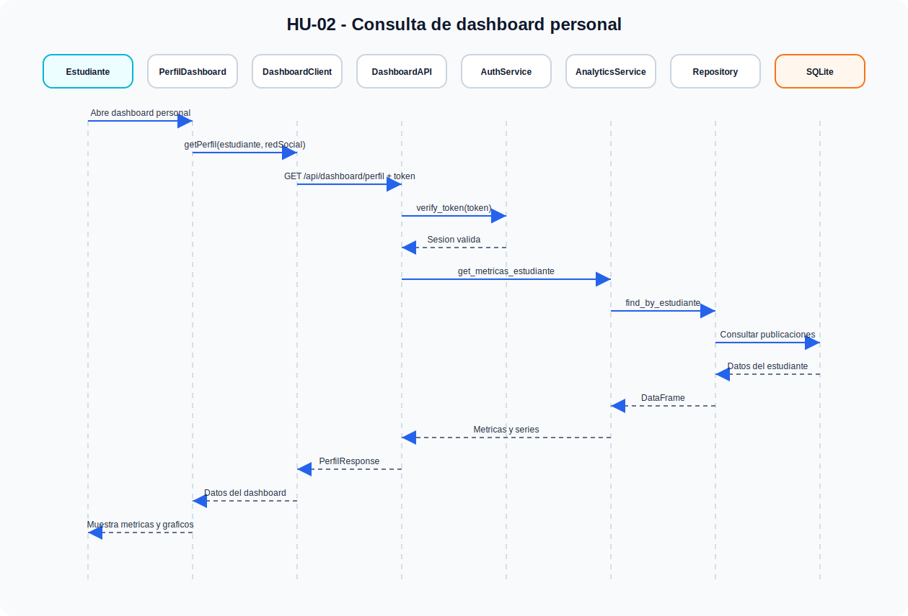

#### HU-03 Filtro por red social en dashboard personal

**Como** estudiante EPIS,  
**quiero** filtrar mi dashboard personal por red social,  
**para** analizar mi rendimiento específico en LinkedIn, Instagram o YouTube.

**Criterios de aceptación**

- El sistema debe mostrar una opción general para todas las redes.
- El sistema debe permitir filtrar por LinkedIn, Instagram y YouTube.
- Al cambiar el filtro, el sistema debe recargar métricas y gráficos.
- El filtro debe aplicarse a las métricas personales y a las series visuales.
- Si se envía una red social inválida, el backend debe responder con error controlado.

**Escenario de prueba**

```gherkin
Dado que el estudiante se encuentra en su dashboard personal
Y existen publicaciones asociadas a YouTube
Cuando selecciona la red social YouTube
Entonces el sistema debe actualizar las métricas del perfil
Y debe mostrar únicamente información correspondiente a YouTube
```

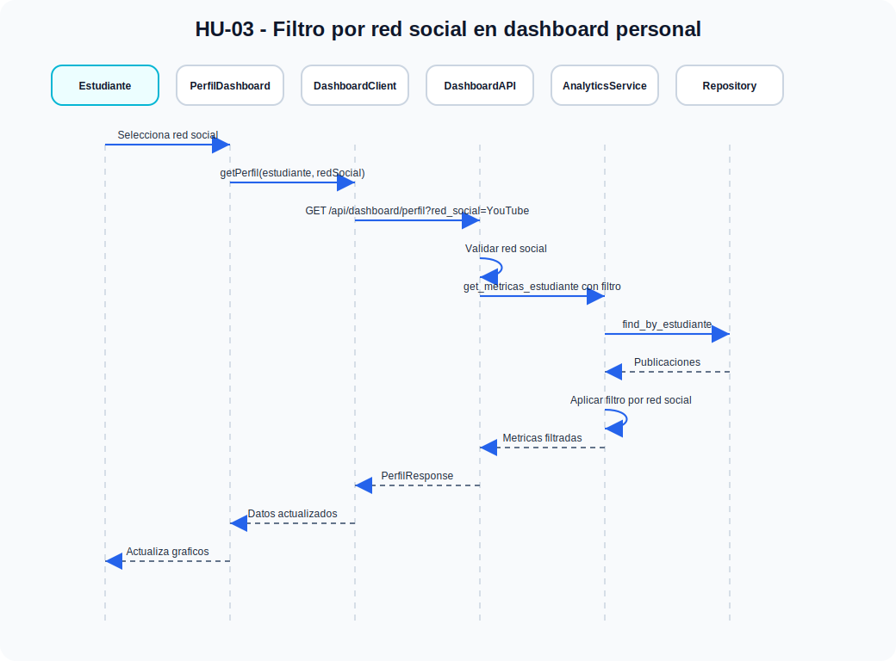

#### HU-04 Consulta de dashboard global

**Como** docente o responsable académico EPIS,  
**quiero** visualizar un dashboard global,  
**para** analizar indicadores agregados de actividad social de los estudiantes.

**Criterios de aceptación**

- El sistema debe permitir acceder al dashboard global solo con token válido.
- El sistema debe mostrar alcance por ciclo académico.
- El sistema debe mostrar interacciones por red social.
- El sistema debe mostrar ranking de estudiantes por participación.
- El sistema debe considerar estudiantes de ciclos I al X.

**Escenario de prueba**

```gherkin
Dado que el usuario inició sesión correctamente
Cuando ingresa a la vista global
Entonces el sistema debe mostrar indicadores agregados
Y debe presentar gráficos por ciclo y red social
```

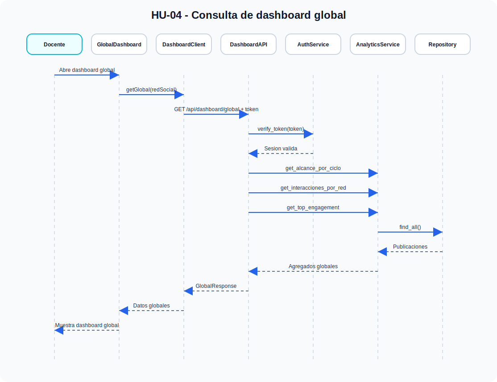

#### HU-05 Filtro por red social en dashboard global

**Como** docente o responsable académico EPIS,  
**quiero** filtrar el dashboard global por red social,  
**para** comparar el comportamiento agregado en LinkedIn, Instagram o YouTube.

**Criterios de aceptación**

- El sistema debe permitir una vista consolidada de todas las redes.
- El sistema debe permitir filtrar por LinkedIn, Instagram y YouTube.
- Al cambiar el filtro, el sistema debe actualizar alcance por ciclo, interacciones y ranking.
- El sistema debe validar que la red social solicitada sea válida.
- Si la red social no es válida, el sistema debe responder con error controlado.

**Escenario de prueba**

```gherkin
Dado que el usuario se encuentra en el dashboard global
Cuando selecciona LinkedIn como red social
Entonces el sistema debe mostrar indicadores globales correspondientes a LinkedIn
```

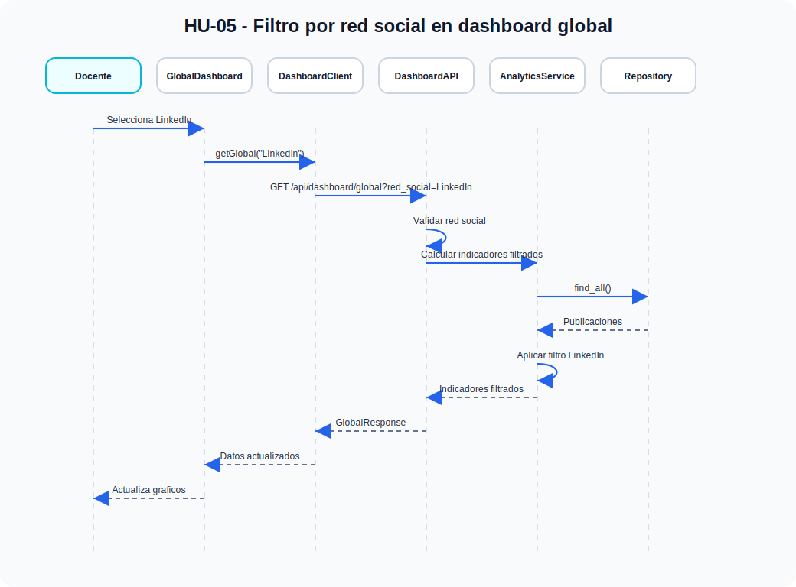

#### HU-06 Consulta de lista de estudiantes

**Como** usuario del sistema,  
**quiero** consultar la lista de estudiantes disponibles,  
**para** seleccionar un estudiante durante el login o futuras búsquedas de perfil.

**Criterios de aceptación**

- El sistema debe exponer un endpoint público para consultar estudiantes.
- El frontend debe cargar la lista al iniciar la pantalla de login.
- La lista debe mostrarse sin requerir token.
- Si no existen estudiantes, el sistema debe mostrar un mensaje controlado.
- La lista debe provenir del repositorio de publicaciones simuladas.

**Escenario de prueba**

```gherkin
Dado que existen estudiantes registrados en la base de datos
Cuando el usuario abre la pantalla de login
Entonces el sistema debe consultar /api/estudiantes
Y debe mostrar los estudiantes disponibles en el combo
```

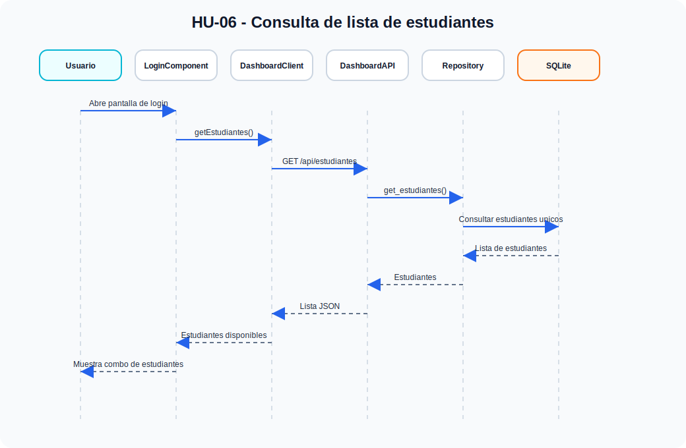

#### HU-07 Protección de rutas privadas con token

**Como** responsable académico,  
**quiero** que las rutas privadas del dashboard estén protegidas por token,  
**para** evitar el acceso no autorizado a información de métricas estudiantiles.

**Criterios de aceptación**

- El sistema debe requerir token para `/api/dashboard/perfil`.
- El sistema debe requerir token para `/api/dashboard/global`.
- Si el token es válido, el backend debe procesar la solicitud.
- Si el token está ausente o es inválido, el backend debe retornar 401.
- El frontend debe enviar el token automáticamente en las solicitudes privadas.

**Escenario de prueba**

```gherkin
Dado que el usuario no tiene token de autenticación
Cuando solicita una ruta privada del dashboard
Entonces el backend debe retornar 401
Y no debe entregar datos del dashboard
```

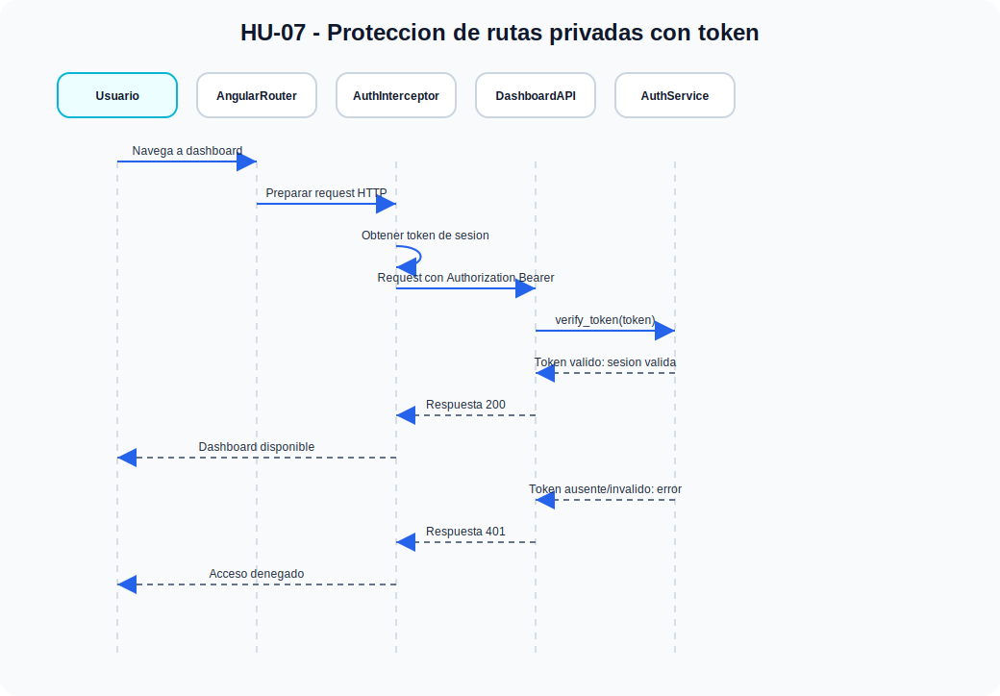

#### HU-08 Visualización de métricas con gráficos

**Como** usuario del dashboard,  
**quiero** visualizar las métricas mediante gráficos,  
**para** interpretar rápidamente tendencias, comparaciones y niveles de interacción.

**Criterios de aceptación**

- El sistema debe mostrar gráficos en el dashboard personal.
- El sistema debe mostrar gráficos en el dashboard global.
- Los gráficos deben actualizarse al cambiar el filtro de red social.
- Los gráficos deben adaptarse al tamaño de pantalla disponible.
- Si no existen datos suficientes, la interfaz debe evitar errores visuales.

**Escenario de prueba**

```gherkin
Dado que el estudiante tiene datos de publicaciones e interacciones
Cuando abre el dashboard personal
Entonces el sistema debe renderizar gráficos de interacciones en el tiempo
Y debe mostrar distribución por red social
```

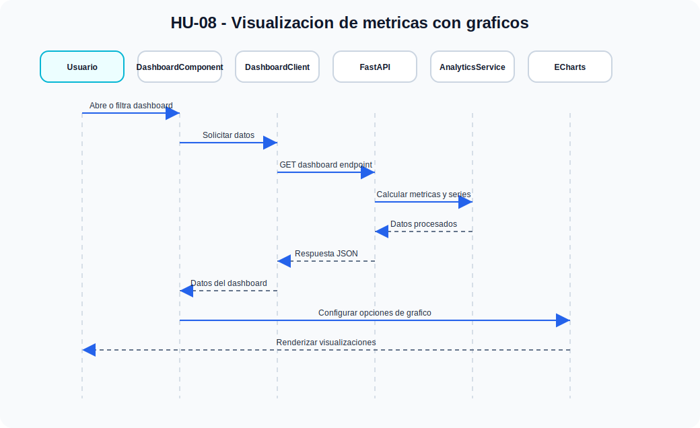

#### HU-09 Validación de infraestructura y costos

**Como** equipo técnico del proyecto,  
**quiero** validar la infraestructura con Terraform e Infracost,  
**para** sustentar la factibilidad técnica y económica antes de un despliegue real.

**Criterios de aceptación**

- El proyecto debe incluir archivos Terraform en `infra/terraform`.
- La configuración debe pasar `terraform init` y `terraform validate`.
- El análisis de costos debe ejecutarse con Infracost.
- El costo base mensual debe quedar documentado.
- No se debe ejecutar `terraform apply` sin aprobación, credenciales y presupuesto.

**Escenario de prueba**

```gherkin
Dado que existe el módulo Terraform del proyecto
Cuando el equipo ejecuta terraform init y terraform validate
Entonces Terraform debe inicializar correctamente
Y debe indicar que la configuración es válida
```

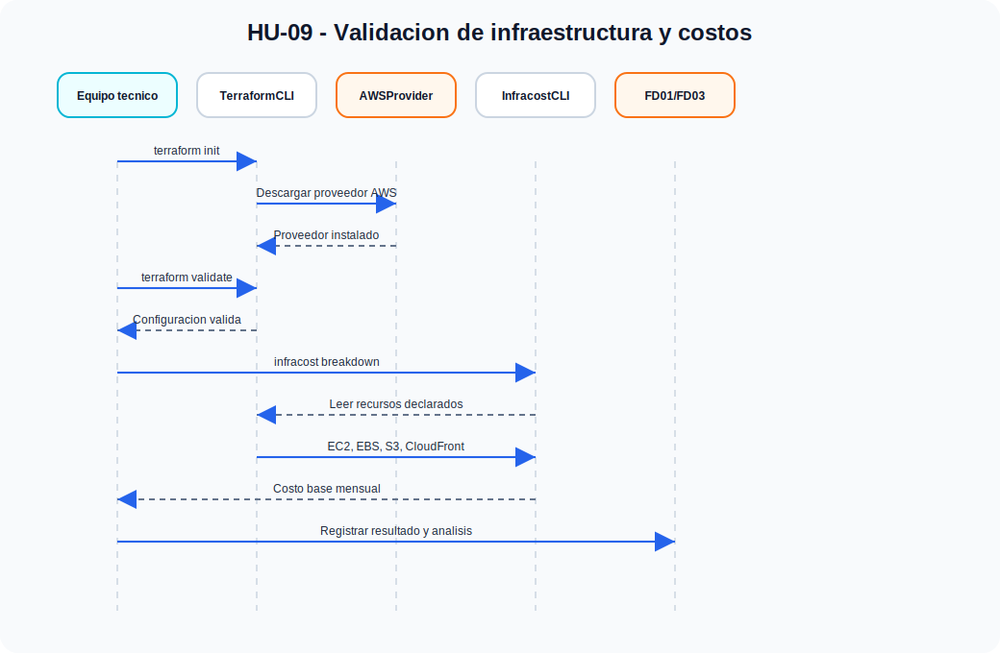

## d. Reglas de Negocio

| ID | Regla de negocio | Descripción |
| :-: | :- | :- |
| RN-01 | Acceso autenticado | Solo usuarios con sesión válida pueden acceder a dashboards privados |
| RN-02 | Redes sociales válidas | El sistema solo acepta LinkedIn, Instagram, YouTube o vista general |
| RN-03 | Ciclos académicos EPIS | Los datos deben considerar ciclos del I al X |
| RN-04 | Usuario demo | Para el prototipo, cada estudiante cuenta con contraseña inicial `epis123` |
| RN-05 | Datos simulados | La versión actual trabaja con datos generados localmente, no con APIs reales |
| RN-06 | Protección por token | Toda solicitud privada debe incluir encabezado `Authorization: Bearer <token>` |
| RN-07 | Infraestructura controlada | Terraform se valida para análisis, pero no se despliega sin aprobación |

# V. Fase de Desarrollo

## 1. Perfiles de Usuario

| Perfil | Descripción | Funciones principales |
| :- | :- | :- |
| Estudiante EPIS | Usuario principal del sistema, asociado a un ciclo académico y actividad social simulada | Iniciar sesión, consultar dashboard personal, filtrar por red social |
| Docente / responsable académico | Usuario interesado en analizar indicadores agregados de estudiantes EPIS | Consultar dashboard global, revisar ranking, analizar alcance por ciclo |
| Equipo técnico | Responsable de desarrollo, pruebas, documentación e infraestructura | Mantener backend, frontend, base de datos, pruebas y Terraform |

## 2. Modelo Conceptual

El modelo conceptual del sistema se organiza alrededor de las entidades **Publicación**, **Usuario** y **FiltrosDashboard**. La publicación concentra la información de actividad social; el usuario permite autenticar el acceso; y los filtros permiten consultar datos por estudiante, ciclo o red social.

| Entidad | Descripción |
| :- | :- |
| Usuario | Representa a un estudiante con credenciales de acceso |
| Publicación | Representa una publicación simulada asociada a estudiante, ciclo, red social, formato, fecha, alcance e interacciones |
| FiltrosDashboard | Representa los criterios de consulta aplicados a los dashboards |
| Dashboard personal | Vista analítica individual por estudiante |
| Dashboard global | Vista analítica agregada para consulta académica |

## a. Diagrama de Paquetes

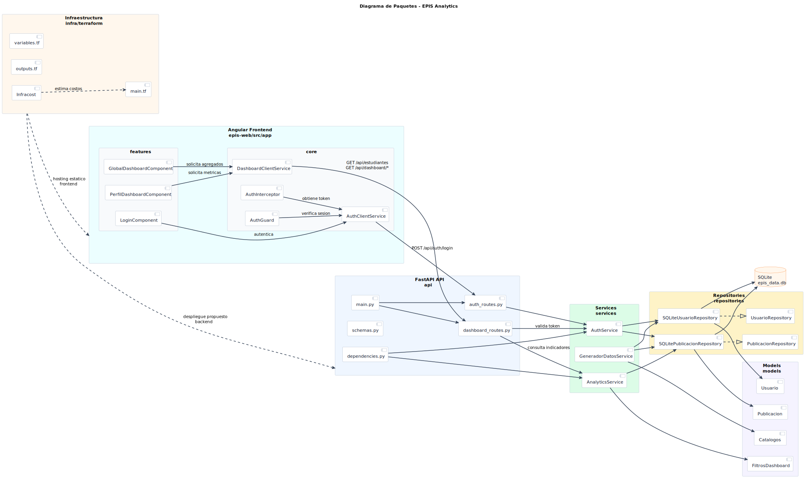

El diagrama fue generado como UML de paquetes a partir del archivo fuente `FD03-EPIS-Informe-Especificacion-Requerimientos-media/media/diagrama-paquetes-epis-analytics.puml`. Representa la separación entre frontend Angular, API FastAPI, servicios, repositorios, modelos, base de datos SQLite e infraestructura Terraform.

## b. Diagrama de Casos de Uso

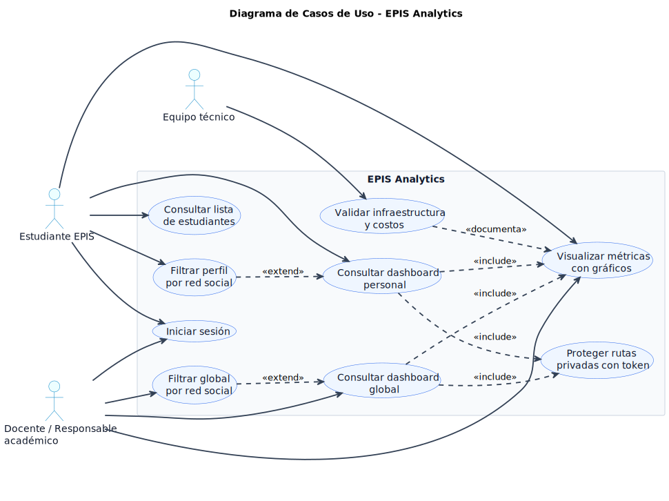

El diagrama fue generado como UML de casos de uso a partir del archivo fuente `FD03-EPIS-Informe-Especificacion-Requerimientos-media/media/casos-uso-epis-analytics.puml`. Representa los actores principales del sistema y su relación con las funcionalidades de autenticación, dashboards, filtros, gráficos, protección por token y validación de infraestructura.

## c. Escenarios de Caso de Uso

Los escenarios de caso de uso se documentan en la sección **IV.c. Cuadro de Requerimientos funcionales Final**, dentro de cada historia de usuario registrada en GitHub Issues:

| Historia | Escenario principal |
| :-: | :- |
| HU-01 | Inicio de sesión exitoso y fallido |
| HU-02 | Consulta exitosa del dashboard personal |
| HU-03 | Filtro por red social en dashboard personal |
| HU-04 | Consulta de dashboard global |
| HU-05 | Filtro por red social en dashboard global |
| HU-06 | Carga de lista de estudiantes |
| HU-07 | Solicitud privada con token ausente o inválido |
| HU-08 | Renderizado de gráficos |
| HU-09 | Validación Terraform e Infracost |

## 3. Modelo Lógico

El modelo lógico describe la organización interna del sistema desde una perspectiva funcional y técnica. EPIS Analytics se estructura en componentes desacoplados que permiten separar presentación, comunicación HTTP, reglas de negocio, acceso a datos y persistencia.

### Componentes lógicos principales

| Componente | Responsabilidad | Elementos relacionados |
| :- | :- | :- |
| Presentación | Mostrar vistas, formularios, filtros y gráficos | Angular Components |
| Cliente HTTP | Consumir endpoints REST del backend | `AuthClientService`, `DashboardClientService` |
| Seguridad frontend | Proteger navegación y adjuntar token | `AuthGuard`, `AuthInterceptor` |
| API REST | Exponer endpoints de autenticación y dashboards | FastAPI routes |
| Servicios de negocio | Procesar autenticación, datos y métricas | `AuthService`, `AnalyticsService`, `GeneradorDatosService` |
| Repositorios | Abstraer acceso a la base de datos | `PublicacionRepository`, `UsuarioRepository` |
| Persistencia | Guardar publicaciones y usuarios | SQLite |
| Infraestructura | Declarar recursos cloud propuestos | Terraform |

### Modelo lógico de datos

| Entidad | Atributos principales | Uso |
| :- | :- | :- |
| `Usuario` | `id`, `estudiante`, `username`, `password_hash`, `rol` | Autenticación y control de sesión |
| `Publicacion` | `id`, `estudiante`, `ciclo`, `red_social`, `formato`, `fecha`, `alcance`, `interacciones`, `engagement_rate` | Base para métricas y dashboards |
| `FiltrosDashboard` | `estudiante`, `fecha_inicio`, `fecha_fin`, `ciclo`, `red_social` | Criterios de consulta y segmentación |

### Flujo lógico general

```text
Usuario
  -> Angular Component
  -> Angular Service
  -> FastAPI Route
  -> Service Layer
  -> Repository Layer
  -> SQLite
  -> Repository Layer
  -> Service Layer
  -> FastAPI Response
  -> Angular Component
  -> Dashboard / Gráficos
```

Este modelo permite que los cambios en la interfaz no afecten directamente la lógica de negocio, y que el acceso a datos pueda evolucionar de SQLite a una base de datos más robusta en una fase posterior.

## a. Análisis de Objetos

| Objeto | Responsabilidad | Relaciones |
| :- | :- | :- |
| `Usuario` | Almacenar credenciales, rol y estudiante asociado | Usado por `AuthService` y `UsuarioRepository` |
| `Publicacion` | Representar datos de actividad social simulada | Usada por `AnalyticsService` y `PublicacionRepository` |
| `AuthService` | Validar credenciales, generar y verificar token | Usa `UsuarioRepository` y `PublicacionRepository` |
| `AnalyticsService` | Calcular métricas, series y rankings | Usa `PublicacionRepository` |
| `DashboardClientService` | Consumir endpoints REST desde Angular | Se comunica con FastAPI |
| `AuthInterceptor` | Agregar token a solicitudes privadas | Usa `AuthClientService` |
| `PerfilDashboardComponent` | Mostrar métricas personales | Usa `DashboardClientService` |
| `GlobalDashboardComponent` | Mostrar métricas agregadas | Usa `DashboardClientService` |

## b. Diagrama de Actividades con objetos

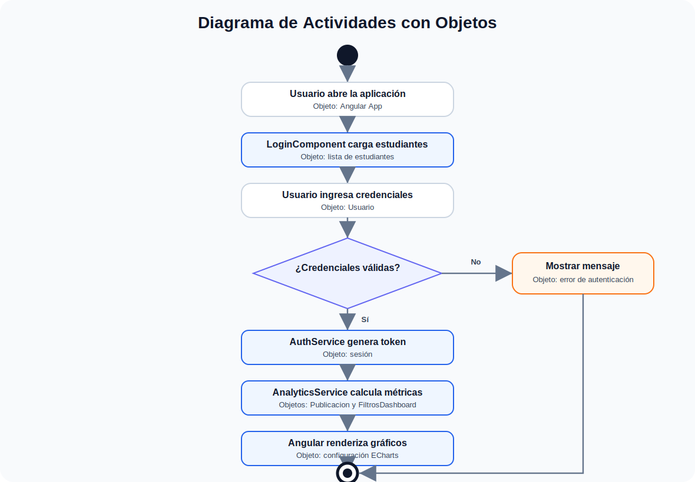

## c. Diagrama de Secuencia

Los diagramas de secuencia principales se encuentran asociados a cada historia de usuario dentro de la sección **IV.c**. Los flujos cubiertos son:

- Autenticación de estudiante.
- Consulta de dashboard personal.
- Filtro por red social en dashboard personal.
- Consulta de dashboard global.
- Filtro por red social en dashboard global.
- Consulta de lista de estudiantes.
- Protección de rutas privadas.
- Visualización de métricas con gráficos.
- Validación de infraestructura y costos.

## d. Diagrama de Clases

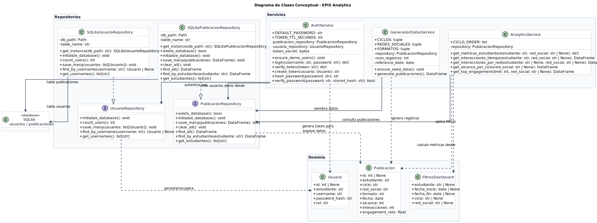

El diagrama fue generado como UML de clases a partir del archivo fuente `FD03-EPIS-Informe-Especificacion-Requerimientos-media/media/diagrama-clases-conceptual-epis-analytics.puml`. Se presenta como modelo conceptual, por lo que solo incluye las clases relevantes del dominio, servicios y repositorios, con sus atributos y métodos principales.

# Conclusiones

1. El sistema EPIS Analytics responde a la necesidad de centralizar y visualizar información de actividad social estudiantil en el contexto de la Escuela Profesional de Ingeniería de Sistemas.

2. La especificación de requerimientos se encuentra sustentada en historias de usuario registradas en GitHub Issues, expresadas en formato **Como... quiero... para...**, con criterios de aceptación y escenarios de prueba.

3. Los escenarios de prueba fueron definidos en formato **Dado... Cuando... Entonces...**, lo que facilita la validación funcional del sistema y su trazabilidad con los requerimientos.

4. Los diagramas de secuencia asociados a las historias de usuario permiten visualizar la interacción entre Angular, FastAPI, servicios, repositorios y base de datos.

5. La arquitectura cliente-servidor con backend organizado por capas permite mantener un sistema modular, testeable y preparado para futuras mejoras.

6. El sistema implementa funcionalidades clave como login con token, dashboard personal, dashboard global, filtros por red social, gráficos y validación de infraestructura con Terraform e Infracost.

7. El prototipo es viable técnica, operativa y económicamente, ya que utiliza herramientas accesibles y mantiene un costo cloud estimado bajo para una posible etapa de despliegue.

8. El documento FD03 queda alineado con FD01, FD02, la Wiki del proyecto y los Issues creados en GitHub, fortaleciendo la trazabilidad documental del proyecto.

# Recomendaciones

1. Agregar manualmente los Issues `#1` al `#9` al GitHub Project creado, debido a que el token disponible no cuenta con permisos `read:project` o `write:project` para automatizar esta acción.

2. Mantener actualizadas las historias de usuario en GitHub Issues conforme se agreguen nuevas funcionalidades o se modifique el alcance del sistema.

3. Vincular cada requerimiento funcional con pruebas automatizadas para mejorar la trazabilidad entre análisis, implementación y validación.

4. Convertir los diagramas PlantUML del documento en imágenes si el formato final de entrega requiere visualización directa en PDF o Word.

5. Considerar una futura migración de SQLite a PostgreSQL si el sistema evoluciona hacia un entorno multiusuario o productivo.

6. Incorporar roles diferenciados para estudiante, docente y administrador en una etapa posterior.

7. Evaluar integración real con APIs oficiales de redes sociales únicamente después de revisar permisos, términos de uso y tratamiento de datos personales.

8. No ejecutar `terraform apply` sin una revisión previa de costos, seguridad, credenciales y presupuesto aprobado.

# Bibliografía

- Pressman, R. S. (2010). *Ingeniería del software: Un enfoque práctico*. McGraw-Hill.
- Sommerville, I. (2011). *Ingeniería de software*. Pearson.
- Fowler, M. (2002). *Patterns of Enterprise Application Architecture*. Addison-Wesley.
- Cockburn, A. (2001). *Writing Effective Use Cases*. Addison-Wesley.
- Schwaber, K., & Sutherland, J. (2020). *The Scrum Guide*. Scrum.org.

# Webgrafía

- Universidad Privada de Tacna. Portal institucional. https://www.upt.edu.pe/upt/
- Universidad Privada de Tacna. Misión y visión institucional. https://www.upt.edu.pe/upt/espg/mision.php
- Universidad Privada de Tacna. Organización y gobierno. https://www.upt.edu.pe/inicio/gobierno.php
- Universidad Privada de Tacna. Facultad de Ingeniería. https://www.upt.edu.pe/upt/web/facultad/contenido/104/83948974
