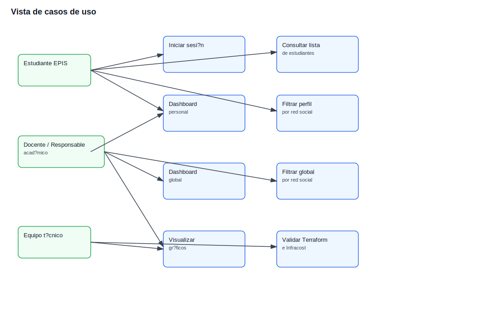
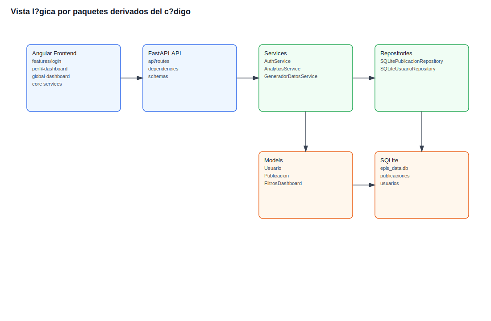
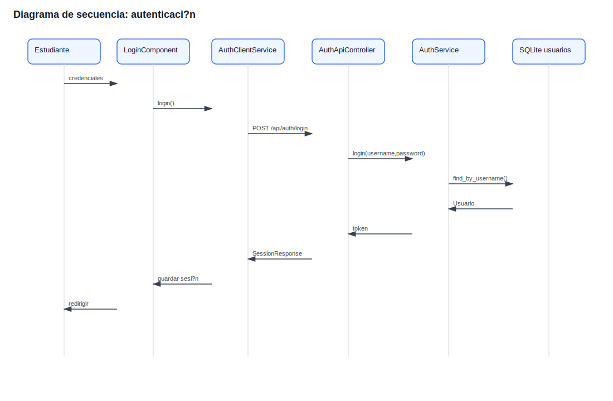
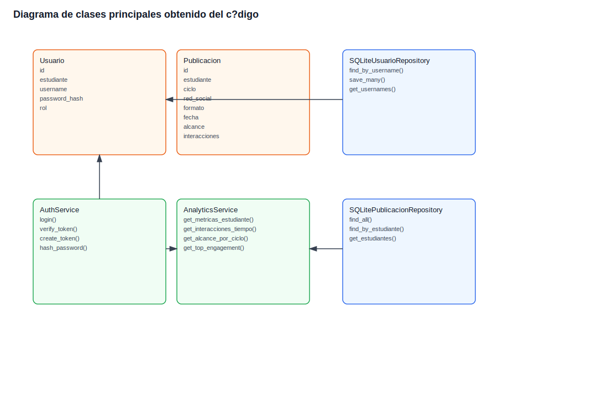
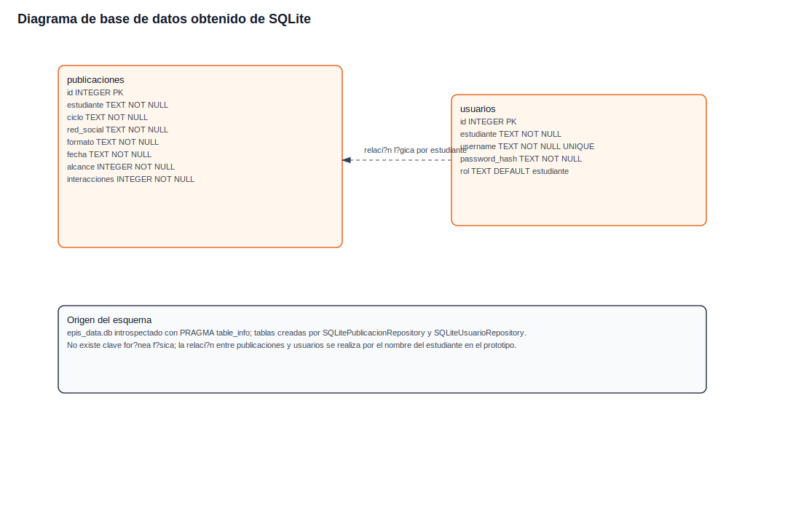
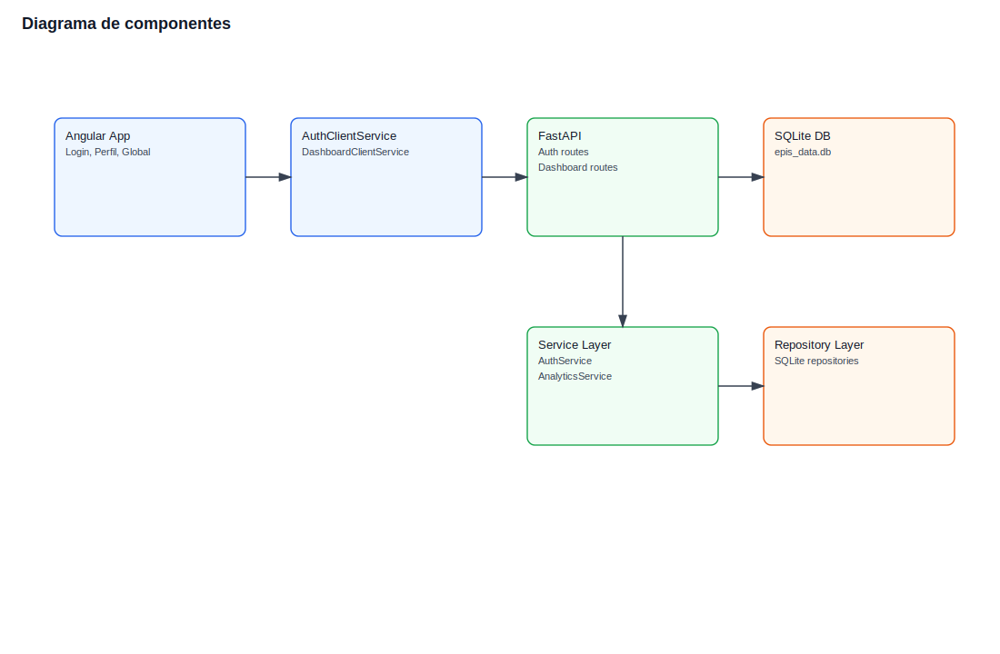
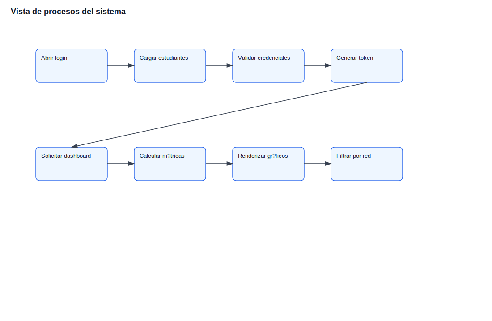
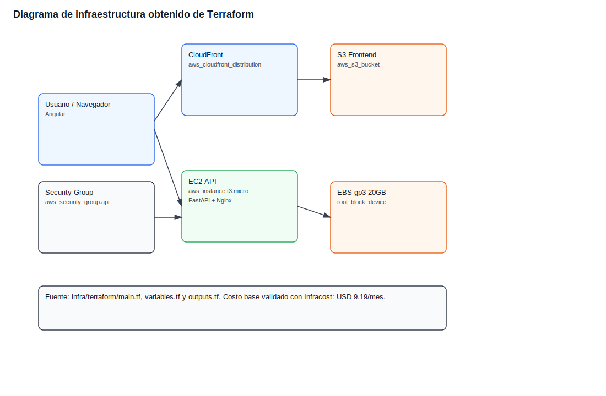

**UNIVERSIDAD PRIVADA DE TACNA**

**FACULTAD DE INGENIERIA**

**Escuela Profesional de Ingeniería de Sistemas**

**Proyecto *EPIS Analytics***

Curso: *Inteligencia de negocios*

Docente: *Mag. Patrick Cuadros Quiroga*

Integrantes:

***Enzo Leonel Laqui Luyo (2022073907)***

***Steven Christopher Yizuka Baldeón (2002023628)***

**Tacna - Perú**

***2026***

\pagebreak

| CONTROL DE VERSIONES ||||||
| :-: | :- | :- | :- | :- | :- |
| Versión | Hecha por | Revisada por | Aprobada por | Fecha | Motivo |
| 1.0 | Equipo del proyecto | Equipo del proyecto | Docente del curso | 25/04/2026 | Versión inicial del informe de arquitectura |

\pagebreak

# Sistema *EPIS Analytics*

## Documento de Arquitectura de Software

Versión *1.0*

| CONTROL DE VERSIONES ||||||
| :-: | :- | :- | :- | :- | :- |
| Versión | Hecha por | Revisada por | Aprobada por | Fecha | Motivo |
| 1.0 | Equipo del proyecto | Equipo del proyecto | Docente del curso | 25/04/2026 | Versión inicial del documento de arquitectura |

\pagebreak

# Índice General

1. [Introducción](#1-introducción)
2. [Objetivos y Restricciones Arquitectónicas](#2-objetivos-y-restricciones-arquitectónicas)
3. [Representación de la Arquitectura del Sistema](#3-representación-de-la-arquitectura-del-sistema)
4. [Atributos de Calidad del Software](#4-atributos-de-calidad-del-software)
5. [Trazabilidad de Diagramas Obtenidos de Código](#5-trazabilidad-de-diagramas-obtenidos-de-código)
6. [Conclusiones](#6-conclusiones)
7. [Recomendaciones](#7-recomendaciones)
8. [Bibliografía y Webgrafía](#8-bibliografía-y-webgrafía)

\pagebreak

# 1. Introducción

## 1.1. Propósito

El presente documento describe la arquitectura de software del sistema **EPIS Analytics**, desarrollado para analizar indicadores de actividad social de estudiantes de la Escuela Profesional de Ingeniería de Sistemas de la Universidad Privada de Tacna.

La arquitectura se documenta siguiendo el enfoque de vistas arquitectónicas, considerando casos de uso, vista lógica, vista de implementación, vista de procesos y vista de despliegue. Además, se incluyen diagramas obtenidos a partir del código e infraestructura real del proyecto, especialmente del backend FastAPI, frontend Angular, repositorios SQLite, base de datos local y módulo Terraform.

## 1.2. Alcance

El documento cubre la arquitectura del prototipo funcional de EPIS Analytics, compuesto por:

- Frontend Angular.
- Backend FastAPI.
- Servicios de negocio en Python.
- Repositorios SQLite.
- Base de datos local `epis_data.db`.
- Autenticación con usuario, contraseña y token.
- Dashboards personal y global.
- Filtros por red social.
- Datos simulados para estudiantes EPIS de ciclos I al X.
- Redes sociales consideradas: LinkedIn, Instagram y YouTube.
- Visualización con ECharts.
- Infraestructura propuesta en Terraform.
- Estimación de costos con Infracost.

No se incluye despliegue real en AWS ni consumo real de APIs de redes sociales, ya que esas actividades forman parte de una etapa futura.

## 1.3. Definiciones, siglas y abreviaturas

| Término | Definición |
| :- | :- |
| API | Interfaz de programación de aplicaciones |
| AWS | Amazon Web Services |
| CORS | Política de intercambio de recursos entre orígenes |
| ECharts | Librería para gráficos utilizada en Angular |
| EPIS | Escuela Profesional de Ingeniería de Sistemas |
| FastAPI | Framework Python usado para la API REST |
| IaC | Infrastructure as Code, infraestructura como código |
| Infracost | Herramienta para estimar costos desde Terraform |
| SQLite | Motor de base de datos local usado en el prototipo |
| Terraform | Herramienta para declarar infraestructura cloud |
| Token | Credencial firmada usada para proteger rutas privadas |
| UPT | Universidad Privada de Tacna |

## 1.4. Organización del documento

El documento se organiza en cuatro bloques principales:

| Bloque | Contenido |
| :- | :- |
| Introducción | Propósito, alcance y términos utilizados |
| Objetivos y restricciones | Priorización de requerimientos funcionales, no funcionales y restricciones |
| Representación arquitectónica | Vistas, diagramas y explicación de componentes |
| Atributos de calidad | Funcionalidad, usabilidad, confiabilidad, rendimiento y mantenibilidad |

\pagebreak

# 2. Objetivos y Restricciones Arquitectónicas

## 2.1. Priorización de requerimientos

| ID | Descripción | Prioridad |
| :-: | :- | :-: |
| RF-01 | Iniciar sesión con usuario y contraseña | Alta |
| RF-02 | Consultar dashboard personal | Alta |
| RF-03 | Filtrar dashboard personal por red social | Alta |
| RF-04 | Consultar dashboard global | Alta |
| RF-05 | Filtrar dashboard global por red social | Alta |
| RF-06 | Consultar lista de estudiantes | Media |
| RF-07 | Proteger rutas privadas con token | Alta |
| RF-08 | Visualizar métricas mediante gráficos | Alta |
| RF-09 | Validar infraestructura y costos | Media |

## 2.1.1. Requerimientos funcionales

| ID | Descripción | Prioridad |
| :-: | :- | :-: |
| RF-01 | Iniciar sesión con usuario, contraseña y token | Alta |
| RF-02 | Consultar dashboard personal del estudiante autenticado | Alta |
| RF-03 | Filtrar dashboard personal por red social | Alta |
| RF-04 | Consultar dashboard global con indicadores agregados | Alta |
| RF-05 | Filtrar dashboard global por LinkedIn, Instagram o YouTube | Alta |
| RF-06 | Listar estudiantes disponibles para login y consulta | Media |
| RF-07 | Proteger rutas privadas mediante token válido | Alta |
| RF-08 | Visualizar métricas mediante gráficos | Alta |
| RF-09 | Validar infraestructura y costos con Terraform e Infracost | Media |

## 2.1.2. Requerimientos no funcionales y atributos de calidad

| ID | Descripción | Prioridad |
| :-: | :- | :-: |
| RNF-01 | Seguridad: rutas privadas protegidas por token | Alta |
| RNF-02 | Usabilidad: interfaz clara para login, dashboard personal y dashboard global | Alta |
| RNF-03 | Rendimiento: consultas del prototipo en tiempos aceptables | Media |
| RNF-04 | Mantenibilidad: backend organizado por capas | Alta |
| RNF-05 | Portabilidad: frontend y backend separables, con proyección a cloud | Media |
| RNF-06 | Testeabilidad: pruebas backend, frontend y validación Terraform | Alta |
| RNF-07 | Escalabilidad funcional: preparada para nuevas redes o datos reales | Media |
| RNF-08 | Control de costos: estimación con Infracost antes del despliegue | Media |

## 2.2. Restricciones

| Restricción | Descripción |
| :- | :- |
| Datos simulados | El prototipo no consume datos reales de LinkedIn, Instagram ni YouTube |
| Ciclos académicos | La información simulada considera ciclos EPIS del I al X |
| SQLite | La persistencia local es suficiente para prototipo, no para producción multiusuario |
| Despliegue cloud | Terraform fue validado, pero no se ejecutó `terraform apply` |
| Seguridad | El token firmado es adecuado para prototipo; producción requiere gestión robusta de secretos |
| CORS | El backend permite origen local Angular en desarrollo |
| Costos | La infraestructura propuesta debe mantenerse en bajo consumo |
| Tiempo académico | El alcance se limita al prototipo del curso |

\pagebreak

# 3. Representación de la Arquitectura del Sistema

Los diagramas de esta sección fueron elaborados a partir de los artefactos reales del proyecto:

| Fuente | Uso arquitectónico |
| :- | :- |
| `api/routes/*.py` | Endpoints de autenticación, estudiantes y dashboards |
| `services/*.py` | Lógica de autenticación, analítica y generación de datos |
| `repositories/*.py` | Acceso a SQLite y operaciones de persistencia |
| `models/*.py` | Entidades principales del dominio |
| `epis-web/src/app` | Componentes Angular, servicios HTTP, guard e interceptor |
| `epis_data.db` | Esquema real de base de datos introspectado |
| `infra/terraform/*.tf` | Recursos de infraestructura cloud propuestos |

## 3.1. Vista de casos de uso

La vista de casos de uso representa las funcionalidades principales del sistema desde la perspectiva de sus actores.

### Actores

| Actor | Descripción |
| :- | :- |
| Estudiante EPIS | Usuario que consulta sus métricas personales |
| Docente / Responsable académico | Usuario que analiza métricas globales |
| Equipo técnico | Responsable de mantenimiento, pruebas e infraestructura |

## 3.2. Vista lógica

La vista lógica describe la descomposición del sistema en paquetes, capas y clases relevantes para la arquitectura.

### 3.2.1. Diagrama de subsistemas o paquetes

Este diagrama fue derivado de la estructura real de carpetas del proyecto.

### 3.2.2. Diagrama de secuencia

El siguiente diagrama representa el flujo de autenticación implementado en `login.ts`, `auth-client.service.ts`, `auth_routes.py`, `AuthService` y `SQLiteUsuarioRepository`.

### 3.2.3. Diagrama de colaboración

La colaboración principal del sistema ocurre entre componentes Angular, servicios cliente, API FastAPI, servicios de negocio, repositorios y base de datos.

| Colaborador | Responsabilidad |
| :- | :- |
| `LoginComponent` | Captura credenciales y dispara autenticación |
| `AuthClientService` | Consume `/api/auth/login` y guarda sesión |
| `AuthInterceptor` | Adjunta token a rutas privadas |
| `DashboardClientService` | Consume endpoints de dashboards |
| `AuthService` | Valida credenciales y token |
| `AnalyticsService` | Calcula métricas y series |
| `SQLitePublicacionRepository` | Consulta publicaciones |
| `SQLiteUsuarioRepository` | Consulta usuarios |

### 3.2.4. Diagrama de objetos

| Objeto | Estado / atributos relevantes | Relación |
| :- | :- | :- |
| `Usuario` | `username`, `password_hash`, `rol` | Autenticado por `AuthService` |
| `Publicacion` | `estudiante`, `ciclo`, `red_social`, `alcance`, `interacciones` | Procesada por `AnalyticsService` |
| `SessionModel` | `estudiante`, `accessToken`, `tokenType` | Guardado en Angular |
| `PerfilResponse` | `metricas`, `interacciones_tiempo`, `interacciones_por_red` | Respuesta del dashboard personal |
| `GlobalResponse` | `alcance_por_ciclo`, `interacciones_por_red`, `top_engagement` | Respuesta del dashboard global |

### 3.2.5. Diagrama de clases

El diagrama se obtuvo a partir de las clases reales en `models`, `services` y `repositories`.

### 3.2.6. Diagrama de base de datos

El diagrama de base de datos fue obtenido desde `epis_data.db` usando `PRAGMA table_info`. Las tablas reales encontradas son `publicaciones` y `usuarios`.

#### Tablas principales

| Tabla | Propósito |
| :- | :- |
| `publicaciones` | Almacenar publicaciones simuladas, red social, ciclo, alcance e interacciones |
| `usuarios` | Almacenar credenciales de acceso y rol del estudiante |

## 3.3. Vista de implementación

La vista de implementación muestra cómo las capas lógicas se corresponden con los componentes físicos del proyecto.

### 3.3.1. Diagrama de arquitectura software

La arquitectura software se organiza en frontend, API, servicios, repositorios, modelos y base de datos.

### 3.3.2. Diagrama de arquitectura del sistema

| Capa | Implementación | Archivos principales |
| :- | :- | :- |
| Presentación | Angular | `epis-web/src/app/features` |
| Cliente HTTP | Angular services | `auth-client.service.ts`, `dashboard-client.service.ts` |
| Seguridad frontend | Guard e interceptor | `auth.guard.ts`, `auth.interceptor.ts` |
| API REST | FastAPI routes | `auth_routes.py`, `dashboard_routes.py` |
| Servicios | Python services | `auth_service.py`, `analytics_service.py` |
| Repositorios | SQLite repositories | `sqlite_publicacion_repository.py`, `sqlite_usuario_repository.py` |
| Modelos | Python dataclasses | `publicacion.py`, `usuario.py`, `filtros_dashboard.py` |
| Infraestructura | Terraform | `infra/terraform/main.tf` |

## 3.4. Vista de procesos

La vista de procesos describe el flujo principal del sistema, desde el acceso del usuario hasta la visualización del dashboard.

## 3.5. Vista de despliegue

La vista de despliegue se basa en el módulo Terraform real del proyecto. La infraestructura propuesta incluye EC2 para backend, S3 y CloudFront para frontend, EBS para almacenamiento y Security Group para control de acceso.

### Recursos Terraform identificados

| Recurso | Archivo | Propósito |
| :- | :- | :- |
| `aws_instance.api` | `main.tf` | Ejecutar backend FastAPI |
| `root_block_device` | `main.tf` | Volumen EBS gp3 de 20 GB |
| `aws_s3_bucket.frontend` | `main.tf` | Hospedar build Angular |
| `aws_cloudfront_distribution.frontend` | `main.tf` | Distribuir frontend con cache |
| `aws_security_group.api` | `main.tf` | Controlar acceso a SSH, HTTP y API |
| `aws_cloudfront_origin_access_control.frontend` | `main.tf` | Acceso privado de CloudFront a S3 |

\pagebreak

# 4. Atributos de Calidad del Software

## 4.1. Escenario de funcionalidad

| Elemento | Descripción |
| :- | :- |
| Estímulo | El usuario solicita un dashboard personal o global |
| Fuente | Estudiante, docente o responsable académico |
| Respuesta | El sistema retorna métricas y gráficos según filtro aplicado |
| Medida | Las rutas responden con datos estructurados JSON y la interfaz renderiza visualizaciones |

## 4.2. Escenario de usabilidad

| Elemento | Descripción |
| :- | :- |
| Estímulo | Usuario ingresa al sistema desde navegador |
| Fuente | Estudiante o docente |
| Respuesta | El sistema muestra login, navegación y filtros comprensibles |
| Medida | El usuario puede acceder a dashboard y cambiar red social sin instrucciones externas |

## 4.3. Escenario de confiabilidad y seguridad

| Elemento | Descripción |
| :- | :- |
| Estímulo | Solicitud a endpoint privado sin token |
| Fuente | Usuario no autenticado |
| Respuesta | Backend retorna 401 y no entrega datos |
| Medida | `/api/dashboard/perfil` y `/api/dashboard/global` requieren encabezado `Authorization: Bearer` |

## 4.4. Escenario de rendimiento

| Elemento | Descripción |
| :- | :- |
| Estímulo | Usuario cambia filtro por red social |
| Fuente | Interfaz Angular |
| Respuesta | API calcula métricas filtradas y frontend actualiza gráficos |
| Medida | Respuesta adecuada para dataset simulado local |

## 4.5. Escenario de mantenibilidad

| Elemento | Descripción |
| :- | :- |
| Estímulo | Se requiere agregar una nueva red social o modificar cálculo de métricas |
| Fuente | Equipo técnico |
| Respuesta | Cambios localizados en catálogos, servicios analíticos y vistas |
| Medida | Arquitectura por capas reduce impacto entre frontend, backend y base de datos |

## 4.6. Otros escenarios

| Atributo | Escenario |
| :- | :- |
| Portabilidad | Frontend y backend se ejecutan separados y pueden desplegarse en nodos distintos |
| Control de costos | Infracost estima costo base mensual de USD 9.19 antes de desplegar |
| Testeabilidad | Backend, frontend y Terraform tienen comandos de validación ejecutables |

\pagebreak

# 5. Trazabilidad de Diagramas Obtenidos de Código

| Diagrama | Archivo generado | Fuente usada |
| :- | :- | :- |
| Casos de uso | `fd04-01-casos-uso.svg` | GitHub Issues HU-01 a HU-09 y FD03 |
| Paquetes | `fd04-02-paquetes.svg` | Carpetas `api`, `services`, `repositories`, `models`, `epis-web` |
| Secuencia login | `fd04-03-secuencia-login.svg` | `login.ts`, `auth-client.service.ts`, `auth_routes.py`, `auth_service.py` |
| Clases | `fd04-04-clases.svg` | Clases reales de modelos, servicios y repositorios |
| Base de datos | `fd04-05-base-datos.svg` | `epis_data.db` y repositorios SQLite |
| Componentes | `fd04-06-componentes.svg` | Servicios Angular, rutas FastAPI y capas backend |
| Procesos | `fd04-07-procesos.svg` | Flujo real de login, consulta y filtrado |
| Infraestructura | `fd04-08-infraestructura.svg` | `infra/terraform/main.tf`, `variables.tf`, `outputs.tf` |

## Validaciones relacionadas

| Validación | Resultado |
| :- | :- |
| Backend | `python -m pytest -q`: 50 pruebas pasadas |
| Frontend | `npm test -- --watch=false`: 2 pruebas pasadas |
| Build Angular | `npm run build`: correcto |
| Terraform | `terraform init` y `terraform validate`: correcto |
| Infracost | `OVERALL TOTAL $9.19` |

# 6. Conclusiones

1. EPIS Analytics utiliza una arquitectura cliente-servidor con separación clara entre frontend Angular y backend FastAPI.

2. El backend está organizado por capas: rutas, servicios, repositorios y modelos, lo que mejora la mantenibilidad del sistema.

3. La base de datos SQLite contiene dos tablas principales, `publicaciones` y `usuarios`, derivadas directamente del prototipo funcional.

4. La infraestructura propuesta fue declarada en Terraform y validada con Infracost, cumpliendo la exigencia de diagramar infraestructura a partir del código.

5. Los diagramas incluidos fueron generados desde la estructura real del proyecto, el esquema de base de datos y los archivos Terraform.

6. El documento queda disponible en formato Markdown y preparado para ser exportado a PDF.

# 7. Recomendaciones

1. Mantener actualizados los diagramas cuando cambien rutas, servicios, modelos o recursos Terraform.

2. Incorporar generación automática de diagramas en una futura etapa de CI/CD.

3. Migrar SQLite a PostgreSQL si el sistema evoluciona a producción.

4. No ejecutar `terraform apply` sin revisar credenciales, presupuesto, reglas de seguridad y costos.

5. Convertir los diagramas a PlantUML o Mermaid en una etapa posterior si el docente solicita notación UML estricta.

# 8. Bibliografía y Webgrafía

- Bass, L., Clements, P., & Kazman, R. *Software Architecture in Practice*. Addison-Wesley.
- Fowler, M. *Patterns of Enterprise Application Architecture*. Addison-Wesley.
- Pressman, R. *Ingeniería del software: Un enfoque práctico*. McGraw-Hill.
- Sommerville, I. *Ingeniería de software*. Pearson.
- Documentación Angular: https://angular.dev/
- Documentación FastAPI: https://fastapi.tiangolo.com/
- Documentación Terraform: https://developer.hashicorp.com/terraform/docs
- Documentación Infracost: https://www.infracost.io/docs/
